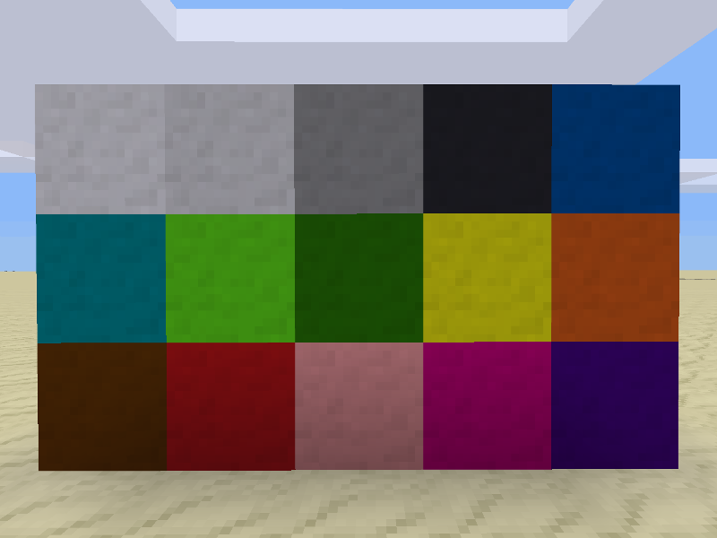
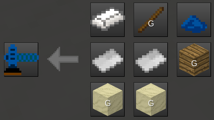
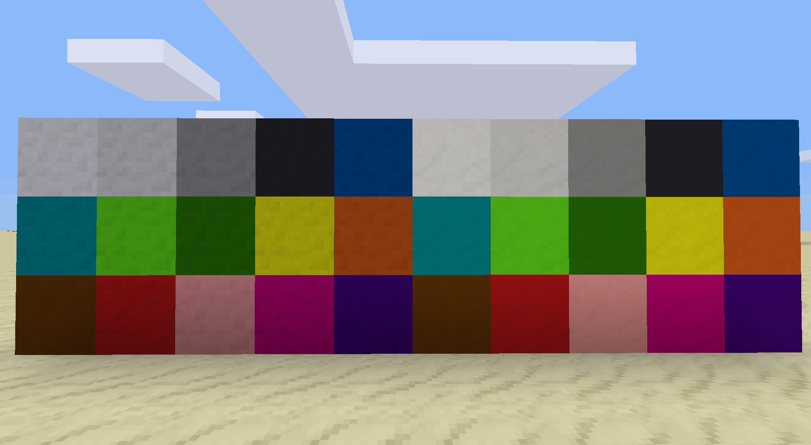

**Craftable and “makeable“ cement blocks.**

# Make wet cement
## Method 1
Craft two wet cement blocks by putting some gravel (`default:gravel`), any type of sand (`group:sand`), and a water bucket (`bucket:bucket_water`) in a shapeless recipe.

## Method 2
Make two dry cement blocks by putting gravel (`default:gravel`) and any type of sand (`group:sand`) in a shapeless recipe and put the resulting blocks of dry cement on ground directly by a water source and wait till it becomes wet.

# Make hard cement
Place wet cement blocks wherever you want (no water sources in neighboring nodes) and let them become hard. Since dry and wet cement blocks fall down when placed you might want to support them while drying by placing a not falling block in the node below.

Hard cement blocks float like regular nodes.

## Coloring
Hard cement can be colored using any of the 15 default dyes. Place a hard cement block and punch it while holding one of the dyes. The dye color gets applied to the node and thus the cement block gets colored. The dye remains in hand and won’t be removed.

## Sanding
A hard cement can be sanded to get a sanded cement block with a smoother texture that is brighter. For doing this a sanding tool is needed.

When using the tool on a hard cement block (like with all other tools simply click the node) the block gets sanded. The tool has wear, but lasts very long.

Of course all sanded cement blocks can be colored, too.

When sanding a colored hard cement block removes the color. Sanding other blocks nothing happens.
